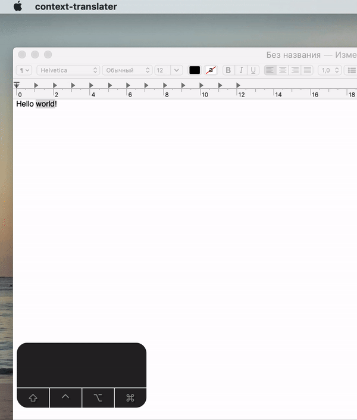

# context-translater

Simple translater for macos
language ENG -> RUS, translate engine google api, for non commercial usage

First start: 
1. Choose Preferences in menu bar, 
2. Press "Main shortcut" and choose your shortcut, example "cmd+s"

Usage: 
1. Copy some text to buffer example "cmd+c" or dif
2. Press shortcut your choose in "Main shortcut example "cmd+s"

todo list:
1. Remove intermediate action (copy to clipboard)
2. The translation window is displayed near the mouse pointer, on top of the rest of the windows
3. Hide the translation window when the application starts
4. Use a quality api as a translation, for example, https://ocr.space/OCRAPI
5. The translation window is translucent and dynamically stretches depending on the number of words
6. Choosing a translation language
7. Button to listen to the translation directly in the translation window
8. Minimize to tray
